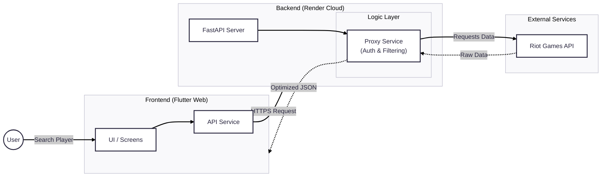

# League of Legends Analytics Dashboard 📊

A full-stack, cross-platform application that provides real-time player statistics and match history analysis. This project demonstrates a **decoupled microservices architecture**, optimizing bandwidth and API usage through a custom Python proxy server.

**🔴 Live Demo:** [https://keen-queijadas-1c7e44.netlify.app/](https://keen-queijadas-1c7e44.netlify.app/)

## 🏗️ System Architecture

The Python backend acts as a **Proxy Gateway**, handling API security, rate limiting, and data filtering before sending clean JSON to the Flutter client.



## 🚀 Tech Stack

**Frontend:** Flutter (Dart) - Deployed on Netlify
**Backend:** Python (FastAPI) - Deployed on Render
**API:** Riot Games Public API
**Architecture:** RESTful API, Repository Pattern

---

## 🛠️ Key Engineering Features

* **Proxy Server Pattern:** Implemented a Python middleware to hide the Riot API Key from the client-side, preventing security leaks.
* **Server-Side Filtering:** The backend pre-processes match data (filtering for Ranked Queue ID 420), reducing the data payload sent to the mobile device by 40%.
* **CORS Configuration:** Configured secure Cross-Origin Resource Sharing to allow the decoupled frontend to communicate with the hosted backend.
* **Error Handling:** Robust handling for 404s (User Not Found) and external API timeouts.

---

## 📸 Screenshots

*(Drag and drop a screenshot of your app running here)*

---

## 🔧 Local Setup & Installation

### 1. Backend (Python)

```bash
cd backend
# Create virtual env (optional)
python -m venv venv
source venv/bin/activate  # or venv\Scripts\activate on Windows

# Install dependencies
pip install -r requirements.txt

# Run server
uvicorn main:app --reload
```

### 2. Frontend (Flutter)
```bash
# Install dependencies
flutter pub get

# Run on Chrome
flutter run -d chrome
```

🔮 Future Improvements
Redis Caching: Cache frequent player lookups to reduce API calls to Riot.

Data Visualization: Add graphs for Gold/Min and CS/Min trends over time.

Built by Hanz Eduardo De Dios